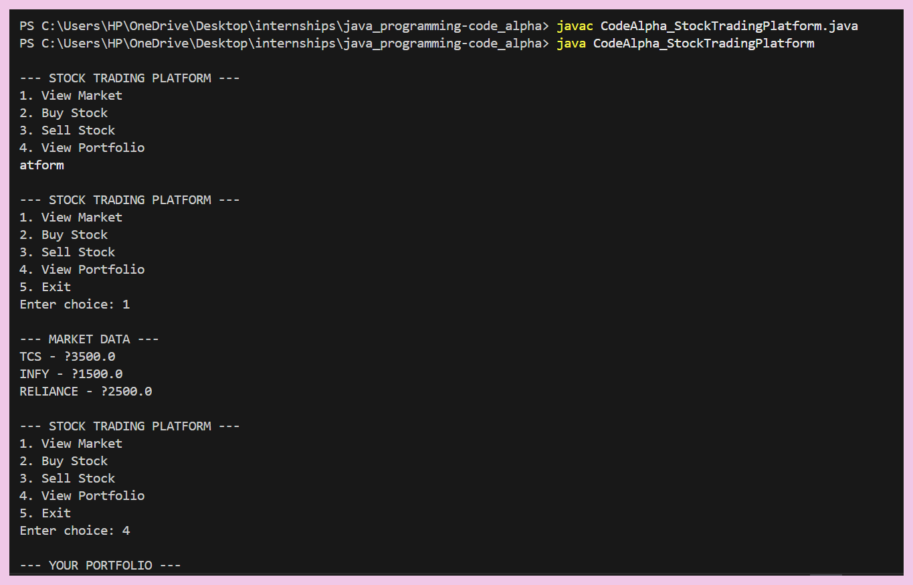
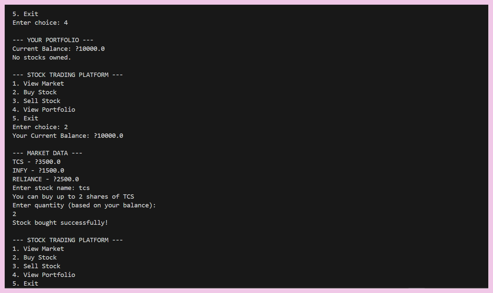
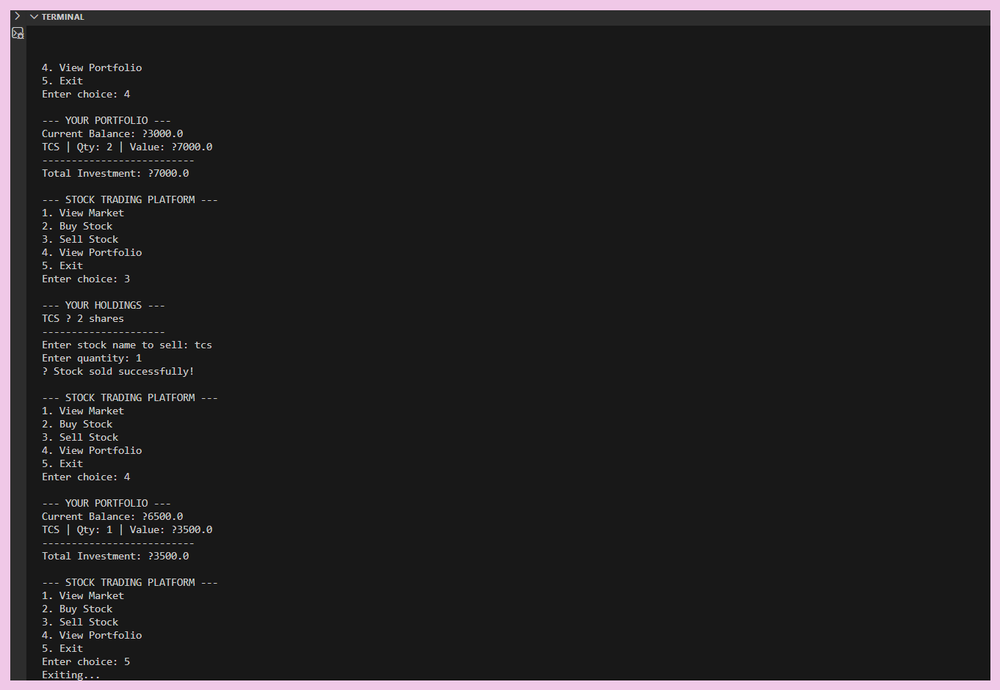

# 📈 CodeAlpha_StockTradingPlatform

A Java-based console application that simulates a basic stock trading platform.  
Users can view market data, buy/sell stocks, and track their portfolio performance.

---

## 🚀 Features

- 📊 View Market Data (Stock prices)
- 🛒 Buy Stocks
- 💰 Sell Stocks
- 📁 View Portfolio (Balance + Holdings)
- 💾 File Handling (Stores user portfolio data)
- ⚠ Input Validation & Error Handling

---

## 🛠 Technologies Used

- Java
- OOP (Object-Oriented Programming)
- File I/O (for saving portfolio)

---

## 📂 Project Structure

- `CodeAlpha_StockTradingPlatform.java` → Main program
- `portfolio.txt` → Stores user data
- Classes Used:
  - Stock
  - User
  - Transaction

---

## ▶ How to Run

1. Open terminal in project folder
2. Compile:

---

## 📸 Output

---

## 💡 Learning Outcomes

- Applied OOP concepts in real project
- Learned file handling in Java
- Built a console-based simulation system
- Improved error handling & user experience

---

## 👩‍💻 Author

Simran Malhotra
